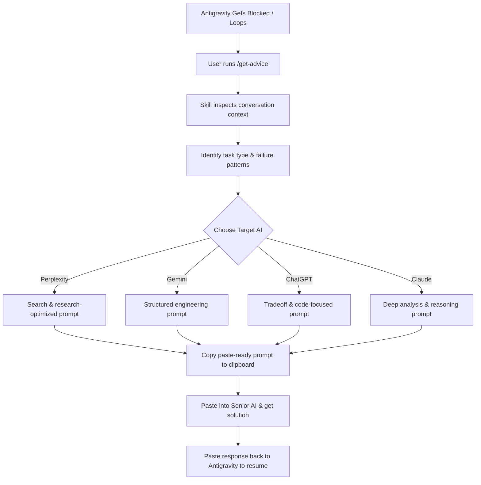

# 🚀 get-advice — Antigravity Global Skill

[](https://opensource.org/licenses/MIT)
[](https://github.com/google/antigravity)
[](#)

A custom Agent Skill for **Google Antigravity** designed to gracefully escalate blocked or looping tasks to an external AI reviewer. 

When your agent gets stuck in a loop or encounters a highly ambiguous task, `/get-advice` acts as a bridge, packaging all relevant context into a structured, model-specific prompt that you can paste into Perplexity, Gemini, ChatGPT, or Claude to get expert guidance.

---

## 🔍 How It Works



---

## ✨ Features

- **Context-Aware Packaging:** Automatically extracts the current code changes, lint errors, and conversation history without requiring you to manually summarize them.
- **Model-Specific Optimization:** Tailors the prompt format and tone to get the absolute best results from your target AI (e.g., deep reasoning for Claude, web-search query style for Perplexity).
- **Zero-Friction Return:** Generates instructions for the external AI to output its recommendations in a format that Antigravity can immediately understand and act upon.

---

## 📦 Folder Structure

The skill repository is organized as follows:

```text
get-advice/
├── SKILL.md                 # Main agent instructions
├── references/              # Guidelines used by the skill to shape prompts
│   ├── task-types.md        # Categorizes the type of block (e.g., debug, design)
│   ├── ai-targets.md        # Custom prompt styles per target AI
│   └── output-schemas.md    # Formats the external AI's return instructions
└── examples/                # Reference walkthroughs
    ├── debugging-example.md
    └── architecture-example.md
```

---

## 🛠️ Installation

### 1. Place the Skill in the Config Directory
Antigravity searches for custom global skills in `~/.gemini/config/skills/`. Place this project there:

```bash
mkdir -p ~/.gemini/config/skills/
cp -r /path/to/get-advice-skill ~/.gemini/config/skills/get-advice
```

### 2. Alternatively, Create a Symlink (Recommended)
If you prefer to keep the repository in your development folder, create a symlink to the config directory:

```bash
ln -s /Users/mast/Documents/VInayPrograming/get-advice ~/.gemini/config/skills/get-advice
```

> [!WARNING]
> **Common Gotcha:** Antigravity's global skill loader scans `~/.gemini/config/skills/`, **NOT** `~/.gemini/antigravity/skills/`. If your skill is not appearing, verify that your symlink or copy is in the correct directory.

### 3. Activate the Skill
Restart your Antigravity session or start a new conversation to load the new skill.

---

## 🚀 Usage

Whenever Antigravity gets stuck, simply type:

```text
/get-advice
```

1. **Reviewer Selection:** Antigravity will ask you which AI model you'd like to use (Perplexity, Gemini, ChatGPT, Claude, etc.).
2. **Copy the Prompt:** The skill will output a beautifully structured Markdown prompt. Copy it to your clipboard.
3. **Run External AI:** Paste the prompt into the chosen AI.
4. **Resume Task:** Paste the external AI's answer back into your Antigravity conversation. The agent will read the instructions and resume coding!

---

## 📄 License

This project is licensed under the MIT License - see the [LICENSE](LICENSE) file for details.
